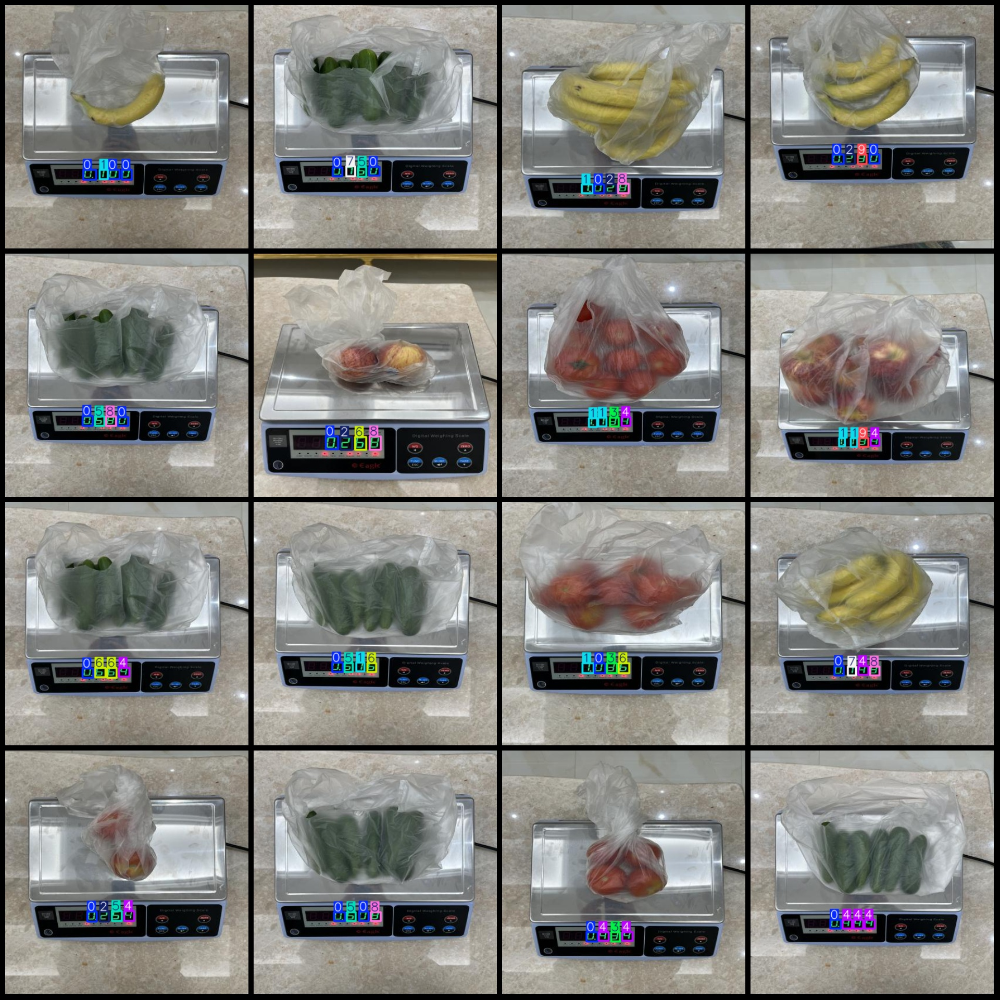
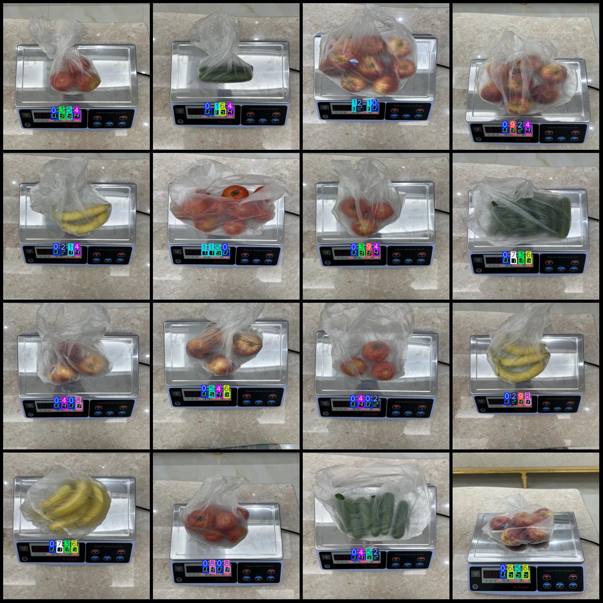

# Shopping Mall Scale Electronic Table Display Digital Measurement Reading Detection Data Set - VOC+YOLO Format with 104 Images for 10 Categories

The dataset consists of 104 images labeled with 10 categories in Pascal VOC format and YOLO format. The format includes only the jpg images, their corresponding VOC XML files, and YOLO txt files 
without any split paths.

- Image count (number of jpg files): 104
- Annotation count (number of xml files): 104
- Annotation count (number of txt files): 104
- Number of categories: 10
- Category label names: ["0","1","2","3","4","5","6","7","8","9"]

Each category has different number of bounding boxes:
- 0 Bounding Boxes = 130
- 1 Bounding Boxes = 41
- 2 Bounding Boxes = 35
- 3 Bounding Boxes = 28
- 4 Bounding Boxes = 51
- 5 Bounding Boxes = 28
- 6 Bounding Boxes = 35
- 7 Bounding Boxes = 23
- 8 Bounding Boxes = 31
- 9 Bounding Boxes = 14

Total number of bounding boxes: 416

Each category occupies a certain number of images:
- 0 Occupies images: 100
- 1 Occupies images: 36
- 2 Occupies images: 32
- 3 Occupies images: 27
- 4 Occupies images: 42
- 5 Occupies images: 26
- 6 Occupies images: 29
- 7 Occupies images: 23
- 8 Occupies images: 28
- 9 Occupies images: 14

Image resolution: 416x416

Annotation tools used: labelImg
Annotation rules: draw bounding boxes for each category

Special notice: This dataset does not include training, validation, or test sets; users are required to manually divide them.

Important note: This dataset does not guarantee the accuracy of the trained models or weights files.

Picture previews:

## Images

Here is a pay link on Stripe ( https://buy.stripe.com/3cs8yP7sY87d0vu9AB ). Please contact me lonlonago@foxmail.com after funding $89, and I will send you a complete data files , thank you!

